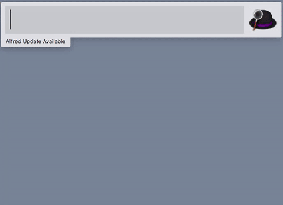

# Goo Japanese Translate Alfred Workflow #

A workflow for [Alfred][alfred].

Alfred workflow for searching the definitive Japanese dictionary at [Goo][goo] with auto-suggest.

## Download and installation ##

Download the Workflow from the [GitHub releases page][releases] or [Packal][packal]. Double-click the `Goo Translate.alfredworkflow` file to install.

## Usage ##

Default keyword is `jp`. Enter your query after that.

Actioning a result with `RETURN` will open the full results page at dictionary.goo.ne.jp in your browser. Pressing `⌘` on a result will show the URL in its subtitle.

## Feedback ##

If you have a feature request, bug report or other query, you can get in touch using the [GitHub issue tracker][issues].

## Licensing, thanks ##

The code of this workflow is released under the [MIT licence][mit].

This workflow is based on the following libraries (also released under the MIT licence):

- The legendary [Beautiful Soup][bs] by [Leonard Richardson][lenny],
- the extremely awesome [Alfred-Workflow][aw] by [Dean Jackson][deanishe].

[alfred]: http://www.alfredapp.com/
[goo]: http://dictionary.goo.ne.jp/
[releases]: https://github.com/rorvte/alfred-goodict/releases/latest
[packal]: http://www.packal.org/workflow/alfred-goodict
[issues]: https://github.com/rorvte/alfred-goodict/issues
[mit]: http://opensource.org/licenses/MIT
[bs]: http://www.crummy.com/software/BeautifulSoup/
[lenny]: http://www.crummy.com/self/
[aw]: http://www.deanishe.net/alfred-workflow/index.html
[deanishe]: https://github.com/deanishe/

